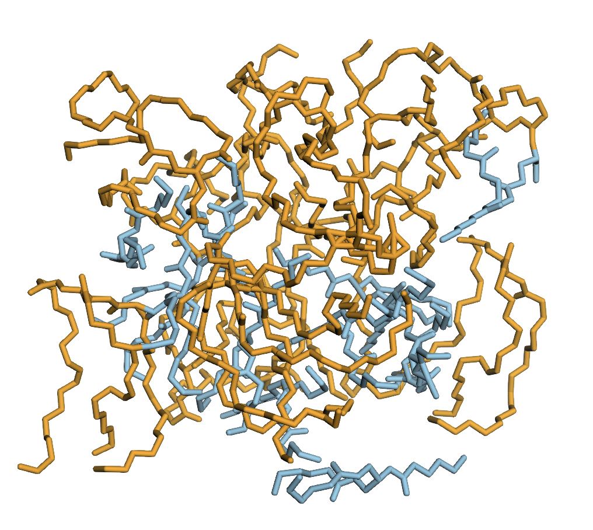
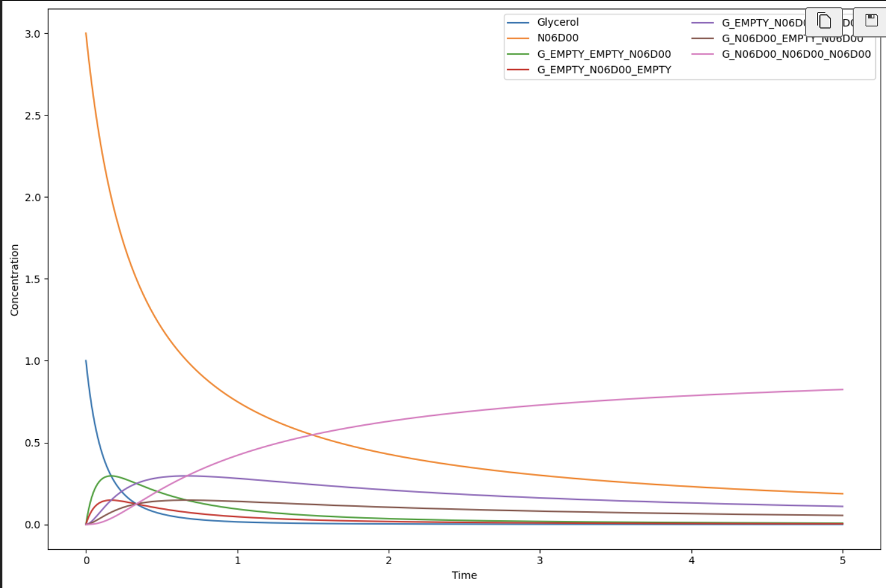

# GLYZE

Glyceride and Lipid sYnthetiZation Engine

## Overview

GLYZE is a python package designed for the study of glycerides. Currently, the package's primary use has been to study the viscocity and melting points of various glycerides using molecular dynamics and various empirical models. The package also allows you to model various chemical processes often associated with glycerides such as interesterication and esterification. 

## Installation

To install the SymmState package, follow these steps:

1. Install the package using pip:
    ```bash
    pip install glyze
    ```
2. Download GROMACS [here](https://manual.gromacs.org/current/download.html) and follow their installation instructions
3. Download multiwfn [here](http://sobereva.com/multiwfn/) and follow their installation instructions

## Features

- Seamless object representation of fatty acid and glycerides:
```python
from glyze import FattyAcid, Glyceride

olein = FattyAcid(length=18, db_positions=(9,), db_stereo=("Z",))
triolein = Glyceride(sn=(olein, olein, olein))

# Various functions available
triolein.molar_mass

# Unique naming schema
triolein.name

# Procedurally generate the glyceride
triolein.glyceride_to_rdkit(optimize=True)
```

- Generation of Glyceride Mixes
```python
from glyze import FattyAcid, Glyceride, GlycerideMix

olein = FattyAcid(length=18, db_positions=(9,), db_stereo=('Z',))
palmitin = FattyAcid(length=16)

triolein = Glyceride(sn=(olein, olein, olein))
tripalmitin = Glyceride(sn=(palmitin, palmitin, palmitin))
 
mix = GlycerideMix(mix=[(triolein, 0.5), (tripalmitin, 0.5)])

# Build simulation box with packmol
box = mix.build_simulation_box(num_molecules=24, density_g_per_cm3=0.7)
box.atoms.write("temp.pdb")
```



- Model esterifcation and other chemical processes

```python
from glyze import FattyAcid, ChemReactSim

olein = FattyAcid(length=18, db_positions=(9,), db_stereo=("Z",))

# Create simulator
sim = create_simulation_batch(list_of_fa=[olein], initial_conc=[1, 3], k_calc="permutation", chem_flag=True)

# Solve rate equations
sim.overall_order = 2.0
sol = sim.solve((0.0, 5.0))

# Plot results
sol.plot(sol, figsize=(12, 8))
```



- Empirically model viscocity of glycerides


For any questions or feedback, please don't hesitate to reach out to us at the email isacvillages@gmail.com.
