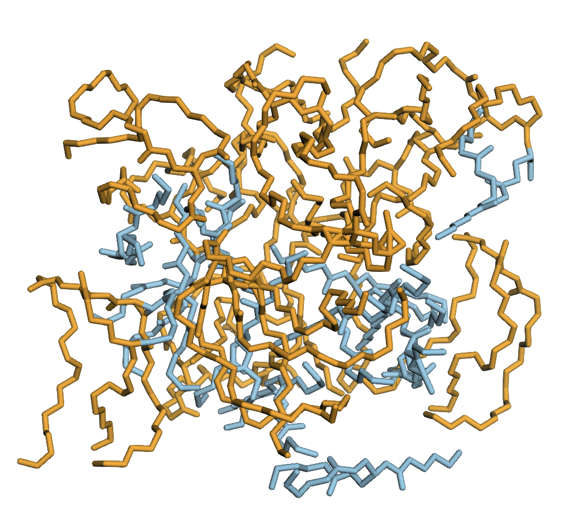
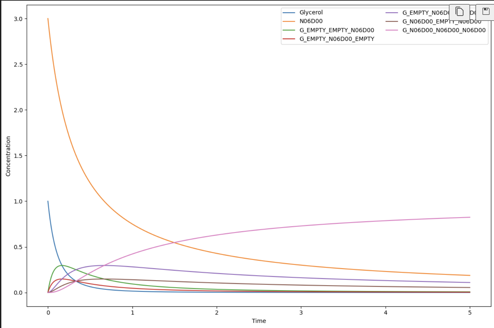
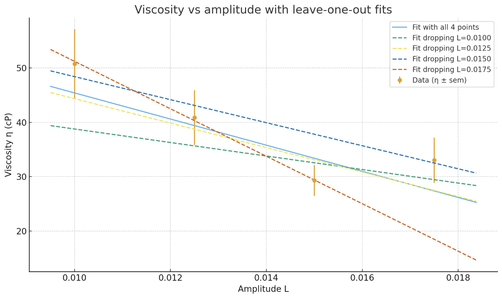

# GLYZE

Glyceride and Lipid sYnthetiZation Engine

## Overview

GLYZE is a Python package designed for the study of glycerides. Currently, the package's primary use has been to study the viscosity and melting points of various glycerides using molecular dynamics and various empirical models. The package also allows you to model various chemical processes often associated with glycerides, such as interesterification and esterification.

## Installation

To install the GLYZE package, follow these steps:

1. Install the package locally using pip:
    ```bash
    pip install .
    ```
2. Download GROMACS [here](https://manual.gromacs.org/current/download.html) and follow their installation instructions
3. Download multiwfn [here](http://sobereva.com/multiwfn/) and follow their installation instructions
4. Launch user interface with:
    ```bash
    glyze
    ```

---

## Features

### Fatty Acids and Glycerides

GLYZE provides a clean, expressive object model for fatty acids and glycerides. `FattyAcid` is a frozen dataclass supporting arbitrary chain lengths, double bond positions with Z/E stereochemistry, and branched chains. `Glyceride` represents mono-, di-, and triglycerides via a three-slot `sn` tuple (sn-1, sn-2, sn-3), and `SymmetricGlyceride` treats sn-1 and sn-3 as equivalent for hashing and equality — which is important for correctly enumerating species in chemical simulations.

```python
from glyze import FattyAcid, Glyceride

# Oleic acid: C18, one double bond at position 9, cis (Z)
olein = FattyAcid(length=18, db_positions=(9,), db_stereo=("Z",))
triolein = Glyceride(sn=(olein, olein, olein))

# Molar mass in g/mol
print(triolein.molar_mass)

# Standardized naming scheme
print(triolein.name)  # e.g. G_N18D01P09Z_N18D01P09Z_N18D01P09Z

# Generate and optionally optimize a 3D RDKit molecule (MMFF/UFF force field)
mol = triolein.glyceride_to_rdkit(optimize=True)
```

Key properties available on `FattyAcid`:

- `name` — standardized string identifier (e.g. `N18D01P09Z`)
- `num_carbons` — total carbon count including all branches
- `vapor_pressure(T)` — vapor pressure in Pascals at temperature T (K)
- `canonical()` — normalized form used for deduplication and sorting

Key properties available on `Glyceride`:

- `name` — standardized string identifier (e.g. `G_N18D01P09Z_N18D01P09Z_N18D01P09Z`)
- `molar_mass` — molecular weight in g/mol (cached after first call)
- `num_carbons` — total carbons including glycerol backbone
- `num_fatty_acids` — 1, 2, or 3 depending on degree of glycerolysis
- `chain_lengths` — tuple of (sn-1, sn-2, sn-3) chain lengths
- `enthalpy_of_vaporization` — estimated enthalpy of vaporization (J/mol), with separate correlations for MAGs, DAGs, and TAGs

---

### Glyceride Mixes

`GlycerideMix` manages collections of glycerides and fatty acids together with their mole quantities. It supports building GROMACS-ready simulation boxes via Packmol and computing solid fat content curves via a DSC model.

```python
from glyze import FattyAcid, Glyceride, GlycerideMix

olein = FattyAcid(length=18, db_positions=(9,), db_stereo=('Z',))
palmitin = FattyAcid(length=16)

triolein = Glyceride(sn=(olein, olein, olein))
tripalmitin = Glyceride(sn=(palmitin, palmitin, palmitin))

mix = GlycerideMix(mix=[(triolein, 0.5), (tripalmitin, 0.5)])

# Build a simulation box using Packmol
box = mix.build_simulation_box(num_molecules=24, density_g_per_cm3=0.7)
box.atoms.write("temp.pdb")
```

`GlycerideMix` can be initialized with mole fractions or absolute mole quantities (set `units="moles"`). It indexes components by a canonical key so that symmetrically equivalent glycerides are treated as the same species. Components can be accessed by name, and the mix can be iterated, printed, or passed directly to chemical process simulators.

---

### Solid Fat Content

The `DSC` module computes solid fat content (SFC) curves for glyceride mixes using thermodynamic models. It supports both single-phase and two-phase melting regimes and can simulate hysteresis between heating and cooling curves.

```python
results = DSC.compute_sfc_curve(mix, T_start_C=-60, T_end_C=60, two_phases=False)
DSC.plot_results(results, hysteresis=True)
```



---

### Esterification Reactor

The `Esterifier` class models a batch esterification reactor — the synthesis of glycerides from glycerol and free fatty acids. It automatically enumerates all MAG, DAG, and TAG species that can form from the provided fatty acid inputs, constructs the full reaction network, and returns a `PKineticSim` object ready to simulate.

```python
from glyze import FattyAcid
from glyze.reactors import Esterifier

olein = FattyAcid(length=18, db_positions=(9,), db_stereo=("Z",))

# Preview the reaction network
rxns = Esterifier.esterification_rxn_list(list_of_fa=[olein])
for r in rxns:
    print(r)

# Build and run the kinetic simulation
# initial_conc: [glycerol, fa1, fa2, ...]
sim = Esterifier.esterification(
    list_of_fa=[olein],
    initial_conc=[1, 3],
    ks=None,           # use default rate constants
    chem_flag=True,    # scale stochastic constants by Avogadro
    units="moles",
)

sim.overall_order = 2.0
sol = sim.solve((0.0, 5.0))
sol.plot(figsize=(12, 8))
```

The reaction network covers:
- Glycerol + fatty acid → MAG (sn-1/3 end positions and sn-2 mid position) + H₂O
- MAG + fatty acid → DAG + H₂O (all regiochemically distinct products)
- DAG + fatty acid → TAG + H₂O

Default rate constants reflect the multiplicity of equivalent positions (e.g., k=2 for sn-1/3 esterification). You can supply a custom `ks` list matching the output of `esterification_rxn_list`.



---

### Interesterification Reactor

The `Interesterifier` class models a batch interesterification reactor — rearrangement of fatty acid chains between existing glycerides. Unlike esterification, this process begins with a mixture of MAGs, DAGs, and/or TAGs rather than free fatty acids and glycerol.

Reactions are controlled by two lists that specify, for each input glyceride, which position is *plucked* (removed) and which position the released fatty acid is directed to (*arranged*):

- `plucked`: `"end"` (sn-1 or sn-3) or `"mid"` (sn-2)
- `arranged`: `"end"` or `"mid"` — determines which pool the free fatty acid enters for reattachment

```python
from glyze import FattyAcid, Glyceride
from glyze.reactors import Interesterifier

olein = FattyAcid(length=18, db_positions=(9,), db_stereo=("Z",))
palmitin = FattyAcid(length=16)

triolein = Glyceride(sn=(olein, olein, olein))
tripalmitin = Glyceride(sn=(palmitin, palmitin, palmitin))

glycerides = [triolein, tripalmitin]
plucked = ["end", "end"]
arranged = ["end", "end"]

# Preview the reaction network
rxns, init_ks = Interesterifier.interesterification_rxn_list(
    list_of_glycerides=glycerides,
    plucked=plucked,
    arranged=arranged,
)

# Build and run the kinetic simulation
sim = Interesterifier.interesterification(
    list_of_glycerides=glycerides,
    initial_conc=[1, 1],
    plucked=plucked,
    arranged=arranged,
    ks=init_ks,
    chem_flag=False,
    units="moles",
)

sol = sim.solve((0.0, 10.0))
sol.plot()
```

---

### Kinetic Simulation (`PKineticSim`)

Both `Esterifier` and `Interesterifier` return a `PKineticSim` object, which is the core ODE solver for chemical kinetics in GLYZE. It uses mass-action kinetics encoded as stoichiometry matrices and integrates the system using SciPy's `solve_ivp`.

```python
# Solve the ODE system over a time interval
sol = sim.solve((0.0, 10.0))

# Plot time evolution of all species
sol.plot(figsize=(12, 8))

# Interactive plot with hover information
sol.plot_interactive()

# Export results to CSV
sol.to_csv("results.csv")

# Convert final state to a GlycerideMix for downstream use
final_mix = sol.glyceride_mix
```

Key attributes and methods:

- `overall_order` — set to override standard mass-action kinetics (e.g., `2.0` for second-order)
- `S()` — net stoichiometry matrix (products minus reactants)
- `alpha()` — kinetic order matrix (respects `overall_order` if set)
- `rates(x)` — instantaneous reaction rates at state `x`
- `glyceride_mix` — property that returns the final composition as a `GlycerideMix`

---

### Deodorizer

The `Deodorizer` class simulates the steam stripping deodorization of a glyceride mix, based on the Lee & King (1937) vapor–liquid equilibrium model. For each component, a remaining moles equation is solved numerically (Newton's method with Brent fallback), with an optional uniform mechanical entrainment loss applied after vapor stripping.

```python
from glyze.reactors import Deodorizer

# Single deodorization run
final_mix = Deodorizer.deodorizer(
    mix=mix,
    S=0.05,           # steam stripping factor [mol steam / mol oil]
    T=523.15,         # temperature in Kelvin (~250 °C)
    P=100.0,          # pressure in Pascals
    entrainment=0.02, # 2% mechanical carryover loss
    plot=True,
)

# Optimize S to hit a target free fatty acid fraction
S_opt = Deodorizer.opt_deodorizer(
    mix=mix,
    T=523.15,
    P=100.0,
    entrainment=0.02,
    target=0.001,     # target FFA fraction (0.1%)
    verbose=True,
    plot=True,
)
```

The relative volatility of each component is computed as `A = P / vapor_pressure(T)`. Components with very high volatility (small A) are treated as fully stripped. The optimizer uses bisection search over the steam factor S and updates the input mix in place upon convergence.

> **Note:** The underlying Lee & King model may underestimate the steam factors required to reproduce experimentally observed glyceride reductions. This is an active area for model improvement.

---

### Empirical Viscosity Model

The `ViscosityCalculator` module provides empirical viscosity predictions for glyceride mixes using fragment-based correlations. Coefficients are defined per carbon chain length (C2–C19), and the mixture viscosity is computed using a mixing rule over mole fractions.

```python
from glyze.viscosity_calculator import ViscosityCalculator

# Compute dynamic viscosity at a given temperature (°C)
eta = ViscosityCalculator.viscosity(mix, T_celsius=60.0)
print(f"Viscosity: {eta:.4f} mPa·s")

# Plot viscosity vs temperature over a range
ViscosityCalculator.plot_viscosity(mix, T_range=(20, 80))
```

Valid temperature ranges vary by chain length — shorter chains (C2–C10) are valid from 20–80 °C, while longer chains (C14–C19) require temperatures of 50 °C or higher.

---

### Molecular Dynamics Viscosity Workflow

For high-fidelity predictions, GLYZE includes a full MD pipeline that computes viscosity via the periodic-perturbation (PP) method in GROMACS. The workflow automates charge assignment (via Multiwfn), topology generation, box preparation (via Packmol), energy minimization, NPT/NVT equilibration, and production runs across a range of perturbation amplitudes.

```python
from glyze.md import EViscosityModel, SimPaths
from pathlib import Path

fchk_paths = [
    Path("fchks/G_N18D01P09Z_N18D01P09Z_N18D01P09Z.fchk"),
    Path("fchks/G_N16D00_N16D00_N16D00_opt.fchk"),
]
pdb_paths = [
    Path("fchks/G_N18D01P09Z_N18D01P09Z_N18D01P09Z.pdb"),
    Path("fchks/G_N16D00_N16D00_N16D00_opt.pdb"),
]
resname_map = {triolein: "TRIO", tripalmitin: "TRIP"}

paths = SimPaths(root=Path("runs/"), ffdir=Path("oplsaa.ff"), name=mix.name)

model = EViscosityModel(
    mix=mix,
    paths=paths,
    fchk_paths=fchk_paths,
    pdb_paths=pdb_paths,
    resname_map=resname_map,
)

model.run_multiwfn_and_build_tops()
model.prepare_initial_configuration(num_molecules=20, density_g_per_cm3=0.5)
model.build_gromacs_system(num_molecules=20)
model.run_energy_minimization()
model.run_npt_equilibration(T=300.0, P=1.0, ns=2.0)
model.run_nvt_equilibration(T=300.0, ns=2.0)

# Sweep perturbation amplitudes to determine linear viscosity regime
pp_runs = model.run_pp_viscosity_sweep(
    T=300.0,
    ns=30.0,
    A_min=0.010,
    A_max=0.020,
    num_datapoints=6,
)

model.analyze_results(pp_runs=pp_runs, ns_per_A=30.0, T=300.0)
```

The analysis step includes dropout methods for robust linear regression over the amplitude–viscosity relationship.



---

### Streamlit UI

GLYZE ships with a Streamlit-based graphical interface. Launch it with:

```bash
glyze
```

The UI includes a glyceride builder, a chemical process simulator (esterification, interesterification, deodorization), and visualization tools — no Python scripting required.

---

## Naming Convention

GLYZE uses a systematic naming scheme for fatty acids and glycerides.

For a fatty acid: `N{length}D{n_double_bonds}P{position}{stereo}...M{branch_pos}...`

For example, oleic acid (C18:1 Δ9 cis) is `N18D01P09Z`, and palmitic acid (C16:0) is `N16D00`.

For a glyceride: `G_{sn1}_{sn2}_{sn3}`, where each slot uses the fatty acid code above or `EMPTY` for an unoccupied position.

`SymmetricGlyceride` canonicalizes sn-1 and sn-3 so that, for example, `G_N16D00_N18D01P09Z_N18D01P09Z` and `G_N18D01P09Z_N18D01P09Z_N16D00` refer to the same species.

---

## Dependencies

Core dependencies include NumPy, SciPy, RDKit, MDAnalysis, Plotly, and Matplotlib. The MD workflow additionally requires GROMACS, Multiwfn, and Packmol.

---

## Contact

For any questions or feedback, please don't hesitate to reach out at isacvillages@gmail.com.

---

Bibliography: references.bib
